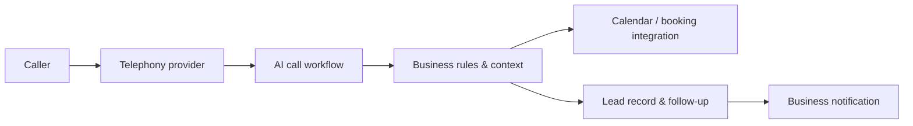

# Handleasy — AI Receptionist Showcase

> Documentation-only public showcase. It contains no production source, customer data, credentials, call recordings, phone numbers, prompts, or infrastructure configuration.

[Live site](https://handleasy.com) · [Portfolio](https://zaydev.work)

Handleasy is an AI receptionist platform for service businesses: it handles inbound-call workflows, captures leads, routes business context, and supports scheduling-oriented follow-up.

## Product surface

- AI-assisted inbound call handling
- Lead capture and structured business context
- Scheduling and booking-oriented workflows
- Business onboarding and operational tooling
- Follow-up and outreach workflows

## System view



## Engineering problems addressed

### Designing a conversation that ends in an operational outcome

The useful result of a receptionist interaction is not a transcript: it is a correctly captured lead, a booked appointment, a clear handoff, or a recorded exception. The workflow is designed to convert unstructured caller input into structured outcomes while retaining context for the business.

### Treating integration events as unreliable

Telephony, calendar, and messaging providers can retry, delay, or duplicate events. Production integrations need signature validation, idempotency keys, retry boundaries, and observable failure paths so a duplicate event does not create duplicate work.

### Containing AI uncertainty

AI output should not be treated as permission to take irreversible action. The workflow uses explicit business rules, confirmation steps where appropriate, and failure routing when confidence or required information is insufficient.

## Production considerations

- Validate provider webhooks and deduplicate event delivery.
- Keep customer context and API credentials server-side.
- Record structured outcomes and error states for review.
- Isolate provider failures so an outage does not corrupt lead or booking state.
- Limit access to business data by account and role.

## Screenshots

Publish only sanitized captures using test data. Suggested filenames:

```md


```
